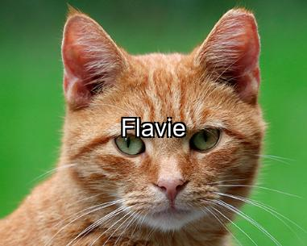

# TextOverlayCat



Este repositório contém um script em Python que realiza as seguintes tarefas:

1. Baixa uma imagem de uma API pública.
2. Adiciona texto centralizado com bordas para melhor legibilidade.
3. Salva a imagem processada localmente.

O script utiliza as bibliotecas `requests` e `Pillow` para manipulação de imagens e comunicação com APIs.

---

## 📋 Funcionalidades

- **Baixar Imagem**: Faz uma requisição a uma API para obter uma imagem.
- **Adicionar Texto Centralizado**: Insere texto no centro da imagem com bordas para contraste.
- **Salvar Imagem**: Armazena a imagem editada localmente no formato `.jpg`.
- **Texto Aleatório**: Usa a API `randomuser.me` para buscar nomes aleatórios e inseri-los na imagem.

---

## 🔧 Pré-requisitos

Certifique-se de que os seguintes itens estão instalados no seu ambiente:

- **Python** 3.7 ou superior.
- Bibliotecas necessárias:
    ```bash
    pip install requests pillow
    ```

---

## 🗂️ Estrutura do Código

### **Funções principais**

1. **`baixar_imagem(url_api)`**
   - Faz uma requisição à URL da API fornecida e retorna a imagem no formato `PIL.Image`.
   - Em caso de erro na requisição, retorna `None`.

2. **`adicionar_texto_centralizado(imagem, texto, tamanho_fonte=50)`**
   - Adiciona texto centralizado na imagem com bordas pretas para contraste.
   - Usa a fonte `arial.ttf` ou a fonte padrão do `Pillow`, caso a Arial não esteja disponível.

3. **`salvar_imagem(imagem, caminho_saida)`**
   - Salva a imagem em um arquivo especificado pelo usuário.

4. **`busca_nome_aleatorio()`**
   - Obtém um nome aleatório da API [Random User Generator](https://randomuser.me).

5. **`main()`**
   - Executa o fluxo principal:
     1. Baixa uma imagem de gato usando a API [Cataas](https://cataas.com).
     2. Obtém um nome aleatório.
     3. Insere o nome na imagem.
     4. Salva a imagem no arquivo `imagem_com_texto_centralizado.jpg`.
     5. Exibe a imagem gerada.

---

## 🚀 Como Usar

1. Clone este repositório:
   ```bash
   git clone https://github.com/SeuUsuario/nome-do-repositorio.git
   cd nome-do-repositorio
